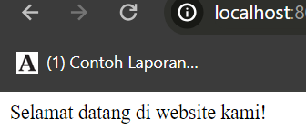

# Apa itu Dinamis?
Web dinamis adalah jenis situs web yang mampu menghasilkan halaman web secara dinamis berdasarkan permintaan pengguna. Artinya, kontennya bisa berubah sesuai dengan input atau keadaan yang diberikan oleh pengguna. Situs web dinamis biasanya menggunakan bahasa pemrograman dan teknologi tertentu untuk mengelola dan menghasilkan konten yang dinamis.
# Apa itu PHP?
PHP (Hypertext Preprocessor) adalah salah satu bahasa pemrograman yang sering digunakan untuk mengembangkan situs web dinamis. PHP adalah bahasa pemrograman sisi server, yang berarti kode PHP dieksekusi di sisi server, bukan di sisi klien (browser pengguna). Dalam konteks situs web dinamis, PHP digunakan untuk menghubungkan antara server web dan [[Pengenalan BasisData + DataBase]], mengolah data, dan menghasilkan konten dinamis.
# Program pertama PHP
## Cara 
1. Buka XAMPP, kemudian klik tombol start pada 'apache'
2. Open file manager
3. Open di Drive D
4. Kemudian Open folder XAMPP
5. Lalu open folder htdocs
6. Buat folder baru di dalam htdocs 
7. Lalu open folder yang sudah Anda buat
8. Open VSCode
9. Open folder yang sudah Anda buat di VSCode
10. Buat file baru di VSCode dengan ekstensi .php di folder yang sudah Anda buka
# PHP Dasar
## Echo
### Kutip satu
kutip satu hanya bisa membaca teks atau STRING, variabel dan string
dipisahkan dengan tanda titik
### Kutip dua
kutip dua bisa membaca nilai dari variabel
### Penjelasan
1. Penggunaan Dasar:
   - `echo` adalah perintah dasar dalam PHP yang digunakan untuk menampilkan teks atau nilai pada halaman web.
   - Anda dapat menggunakan `echo` untuk menampilkan teks statis atau untuk menampilkan nilai dari variabel atau ekspresi.
   - `echo` dapat menerima satu atau lebih argumen yang dipisahkan oleh tanda titik (.) untuk menggabungkan teks dan variabel

2. Menampilkan Teks:
   - Anda dapat menggunakan `echo` untuk langsung menampilkan teks statis dalam tanda kutip ganda ("") atau tanda kutip tunggal ('').
   - Contoh: `echo "Halo, dunia!";`

3. Menampilkan Nilai Variabel:
   - Anda dapat menggunakan `echo` untuk menampilkan nilai dari variabel dalam teks yang ditampilkan.
   - Gunakan operator konkatenasi (tanda titik) untuk menggabungkan teks dan variabel.
   - Contoh:
     ```php
     $nama = "John Doe";
     echo "Halo, nama saya " . $nama . ".";
     ```

4. Menampilkan HTML:
   - Selain teks, Anda juga dapat menggunakan `echo` untuk menampilkan kode HTML di dalam skrip PHP.
   - Uji coba berikut menunjukkan penggunaan `echo` untuk menampilkan elemen HTML:

     ```php
     echo "<h1>Selamat Datang!</h1>";
     echo "<p>Ini adalah halaman web PHP.</p>";
     ```
     
5. Penggunaan Kutipan:
   - Anda dapat menggunakan tanda kutip ganda ("") atau tanda kutip tunggal ('') untuk mengelilingi teks dalam `echo`.
   - Misalnya, `echo "Halo, nama saya 'John'.";`

6. Menggunakan Pemisah:
   - Saat menggunakan `echo` dengan beberapa argumen, Anda dapat menggunakan koma (,) sebagai pemisah antara argumen.
   - Contoh: `echo "Halo,", " nama saya ", $nama, ".";`

Materi `echo` pada PHP memungkinkan Anda untuk menampilkan teks, nilai variabel, dan bahkan kode HTML di dalam skrip PHP. Hal ini berguna dalam menghasilkan tampilan dinamis pada halaman web yang sedang Anda bangun.
## Komentar
### Single line
Komentar Satu Baris:
   - Komentar satu baris dimulai dengan tanda `//` atau `#`.
   - Semua teks setelah tanda tersebut hingga akhir baris diabaikan oleh interpreter PHP.
   - Contoh:
```php

//ini komentar 1 baris menggunakan dua slice

```
### Multiple line
Komentar multibaris dimulai dengan `/*` dan diakhiri dengan `*/`.
   - Semua teks di antara tanda tersebut diabaikan oleh interpreter PHP.
   - Komentar multibaris dapat mencakup beberapa baris kode.
   - Contoh:
```php

/*
ini
komentar
multibaris
menggunakan satu slice dan bintang
*/
```

Tujuan Penggunaan Komentar:
   - Memberikan penjelasan tentang tujuan dan fungsionalitas kode.
   - Membantu dalam pemeliharaan dan pemahaman kode untuk pengembang dan anggota tim lainnya.
   - Menyembunyikan atau menonaktifkan sebagian kode untuk uji coba atau sementara.
   - Meninggalkan catatan atau pesan kepada diri sendiri atau pengembang lain tentang kode tertentu.
Penggunaan komentar yang baik sangat penting dalam pemrograman untuk menjaga kejelasan dan keberlanjutan kode. Dengan menggunakan komentar yang tepat, Anda dapat meningkatkan kemudahan pemeliharaan dan kolaborasi dalam pengembangan perangkat lunak.
## Variabel & Konstanta
### Variabel
 *Variabel*: Variabel adalah simbol yang digunakan untuk menyimpan nilai yang dapat berubah selama jalannya program. Dalam PHP, variabel dinyatakan dengan awalan dolar ($) diikuti dengan nama variabel,
- Variabel adalah tempat penyimpanan untuk nilai-nilai dalam sebuah program.
- Setiap variabel memiliki nama yang unik yang digunakan untuk mengidentifikasinya.
- Variabel dapat menyimpan berbagai jenis data seperti angka, teks, boolean, array, dan lainnya.

```php
$ketua_gank = "bombom";
```

Variabel di atas menyimpan data ketua_genk dengan nilai "bombom". Nilai variabel ini dapat diubah selama jalannya program.
### Constanta
*Konstanta*: Konstanta adalah nilai yang tetap dan tidak dapat diubah selama jalannya program. Mereka berguna untuk menyimpan nilai yang tidak boleh berubah, seperti nilai pi (π) atau nilai-nilai pengaturan yang tetap. Dalam PHP, konstanta didefinisikan menggunakan fungsi define().
- Konstanta adalah nilai yang tetap dan tidak berubah selama jalannya program.
- Nilai konstanta didefinisikan sekali dan tidak dapat diubah kembali.
- Biasanya digunakan untuk menyimpan nilai-nilai seperti konstanta matematis atau pengaturan yang tetap.
```php
const KepSek = "Herwelis";
echo 'KepSeknya Pak ' . KepSek;
```
Dalam contoh di atas, kita mendefinisikan konstanta dKepSek dengan nilai "Herwelis".
## Operator
### Aritmatika
#### Penjelasan
Operator aritmatika merupakan operator untuk melakukan operasi aritmatika.
Operator aritmatika terdiri dari:

| Nama Operator | Simbol |
| ------------- | ------ |
| Penjumlahan   | `+`    |
| Pengurangan   | `-`    |
| Perkalian     | `*`    |
| Pemangkatan   | `**`   |
| Pembagian     | `/`    |
| Sisa Bagi     | `%`    |
#### Program
```php
$a = 5;
$b = 2;

// penjumlahan
$c = $a + $b;
echo "$a + $b = $c";
echo "<hr>";

// pengurangan
$c = $a - $b;
echo "$a - $b = $c";
echo "<hr>";

// Perkalian
$c = $a * $b;
echo "$a * $b = $c";
echo "<hr>";

// Pembagian
$c = $a / $b;
echo "$a / $b = $c";
echo "<hr>";

// Sisa bagi
$c = $a % $b;
echo "$a % $b = $c";
echo "<hr>";

// Pangkat
$c = $a ** $b;
echo "$a ** $b = $c";
```
#### Hasil

### Perbandingan
#### Penjelasan
Operator perbandingan adalah operator untuk membandingkan dua buah nilai.
Hasil operasi dari operator perbandingan akan menghasilkan nilai dengan tipe data _boolean_, yaitu `true` (benar) dan `false` (salah).
Berikut ini daftar operator relasi:

| Nama Operator           | Simbol           |
| ----------------------- | ---------------- |
| Lebih Besar             | `>`              |
| Lebih Kecil             | `<`              |
| Sama Dengan             | `==` atau `===`  |
| Tidak Sama dengan       | `!=` atau `!==`  |
| Lebih Besar Sama dengan | `>=`             |
| Lebih Kecil Sama dengan | `<=`             |
#### Program
```php
// lebih besar
$c = $a > $b;
echo "$a > $b: $c";
echo "<hr>";

// lebih kecil
$c = $a < $b;
echo "$a < $b: $c";
echo "<hr>";

// lebih sama dengan
$c = $a == $b;
echo "$a == $b: $c";
echo "<hr>";

// lebih tidak sama dengan
$c = $a != $b;
echo "$a != $b: $c";
echo "<hr>";
```
#### hasil

### Logika
#### Penjelasan
Operator logika adalah operator untuk melakukan operasi logika seperti `AND`, `OR`, dan `NOT`.
Operator logika terdiri dari:

| Nama Operator         | Simbol |
| --------------------- | ------ |
| Logika AND            | `&&`   |
| Logika OR             | `\|`   |
| Negasi/kebalikan/ NOT | `!`    |
#### Program
```php
$a = true;
$b = false;

// variabel $c akan bernilai false
$c = $a && $b;
printf("%b && %b = %b", $a,$b,$c);
echo "<hr>";

// variabel $c akan bernilai true
$c = $a || $b;
printf("%b || %b = %b", $a,$b,$c);
echo "<hr>";

// variabel $c akan bernilai false
$c = !$a;
printf("!%b = %b", $a, $c);
echo "<hr>";
```

#### Hasil

## Conditional Statement
### if
#### Penjelasan
If merupakan struktur percabangan yang digunakan untuk mengevaluasi suatu kondisi dan menjalankan blok kode tertentu jika kondisi tersebut bernilai benar (true). Jika kondisi bernilai salah (false), maka blok kode tersebut akan dilewati dan program akan melanjutkan ke pernyataan berikutnya.
#### Struktur
```php
if (<kondisi>){
// Blok kode yang dijalankan jika kondisi bernilai true
}
```
#### Program
```php
//if
$total_belanja = 150000;
if($total_belanja > 100000){
    echo "Anda dapat hadiah!";
}
```
#### Hasil

#### Analisis
Array yang dideklarasikan adalah `$barang` dengan isi elemen-elemennya yaitu "Buku Tulis", "Penghapus", dan "Spidol".
Pada blok kode berikutnya, nilai-nilai dalam array `$barang` ditampilkan menggunakan pernyataan `echo`.
- Pernyataan `echo $barang[0]."<br>";` akan menampilkan elemen pertama dalam array `$barang`, yaitu "Buku Tulis", diikuti dengan tag `<br>` untuk membuat baris baru pada tampilan.
- Pernyataan `echo $barang[1]."<br>";` akan menampilkan elemen kedua dalam array `$barang`, yaitu "Penghapus", diikuti dengan tag `<br>`.
- Pernyataan `echo $barang[2]."<br>";` akan menampilkan elemen ketiga dalam array `$barang`, yaitu "Spidol", diikuti dengan tag `<br>`.
#### Kesimpulan program
Program di atas menginisialisasi sebuah array dengan nama `$barang` yang berisi tiga elemen, yaitu "Buku Tulis", "Penghapus", dan "Spidol". Kemudian, program menampilkan isi dari array tersebut dengan menggunakan pernyataan `echo`. Setiap elemen array ditampilkan secara terpisah dengan menggunakan indeks array, yaitu `$barang[0]`, `$barang[1]`, dan `$barang[2]`.
### if-else
#### Penjelasan
Percabangan If/Else adalah permemiliki dua pilihan. Jika `<kondisi>` bernilai `true`, maka blok `if` akan dikerjakan dan jika `<kondisi>` bernilai `false`, maka blok `else` akan dikerjakan.
#### Struktur
```php
if (kondisi) {
    // Blok kode yang dijalankan jika kondisi bernilai true
} else {
    // Blok kode yang dijalankan jika kondisi bernilai false
}
```
#### Program
```php
//if-else
$umur = 13;
if (<kondisi> ){
    echo "Kamu tidak boleh membuka situs ini!";
} else {
    echo "Selamat datang di website kami!";
}
```
#### Hasil

#### Analisis
Jika variabel `$umur` memiliki nilai kurang dari 18, maka pesan "Kamu tidak boleh membuka situs ini!" akan ditampilkan. Jika variabel `$umur` memiliki nilai 18 atau lebih, maka pesan "Selamat datang di website kami!" akan ditampilkan.
#### Kesimpulan program
- Program menggunakan variabel `$umur` dengan nilai 13.
- Terdapat pernyataan `if-else` yang digunakan untuk menentukan pesan yang akan dicetak berdasarkan kondisi yang dievaluasi.
- Namun, dalam kode tersebut, kondisi yang spesifik untuk menentukan apakah pengguna diperbolehkan membuka situs atau tidak tidak ditentukan. Kode `<kondisi>` perlu diganti dengan ekspresi atau pernyataan yang relevan.
- Pesan "Kamu tidak boleh membuka situs ini!" akan dicetak jika kondisi yang dievaluasi bernilai `true` (atau jika kondisi yang dievaluasi tidak sama dengan `false`).
- Jika kondisi yang dievaluasi bernilai `false` (atau jika kondisi yang dievaluasi sama dengan `false`), maka pesan "Selamat datang di website kami!" akan dicetak.
- Tanpa mengetahui kondisi yang spesifik dalam `<kondisi>`, tidak dapat diberikan analisis yang lebih rinci tentang program tersebut.
### if-else if-else
#### Penjelasan
`if-else if-else` adalah sebuah struktur pengendalian alur dalam pemrograman yang digunakan untuk mengevaluasi beberapa kondisi secara berurutan dan menjalankan blok kode yang sesuai dengan kondisi yang pertama kali terpenuhi.
#### Struktur
```php
if (kondisi1) {
    // Blok kode yang dijalankan jika kondisi1 bernilai true
} elseif (kondisi2) {
    // Blok kode yang dijalankan jika kondisi2 bernilai true
} else {
    // Blok kode yang dijalankan jika semua kondisi bernilai false
}
```
#### Program
```php
$nilai = 88;
if ($nilai > 90) {
    $grade = "A+";
} elseif($nilai > 80){
    $grade = "A";
} elseif($nilai > 70){
    $grade = "B+";
} elseif($nilai > 60){
    $grade = "B";
} elseif($nilai > 50){
    $grade = "C+";
} elseif($nilai > 40){
    $grade = "C";
} elseif($nilai > 30){
    $grade = "D";
} elseif($nilai > 20){
    $grade = "E";
} else {
    $grade = "F";
}
echo "Nilai anda: $nilai<br>";
echo "Grade: $grade";
```
#### Hasil

#### Analisis
- Karena nilai 88 lebih besar dari 80, kondisi `$nilai > 80` bernilai `true`.
- Oleh karena itu, variabel `$grade` akan diisi dengan nilai "A".
- Hasil keluaran program akan menjadi:
```
Nilai anda: 88
Grade: A
```
#### Kesimpulan program
- Variabel `$nilai` memiliki nilai 88.
- Terdapat serangkaian pernyataan `if-elseif-else` yang digunakan untuk mengevaluasi nilai dan menentukan grade yang sesuai.
- Evaluasi dimulai dengan kondisi `$nilai > 90`. Jika kondisi tersebut bernilai `true`, maka variabel `$grade` akan diisi dengan nilai "A+".
- Jika kondisi pertama tidak terpenuhi, maka kondisi berikutnya dievaluasi berurutan. Jika kondisi dalam `elseif` bernilai `true`, maka variabel `$grade` akan diisi dengan nilai yang sesuai.
- Jika tidak ada kondisi dalam `if` atau `elseif` yang bernilai `true`, maka blok kode dalam `else` akan dieksekusi, dan variabel `$grade` akan diisi dengan nilai "F".
- Setelah semua kondisi dievaluasi, pesan yang mencetak nilai dan grade akan ditampilkan.
### Switch-case
#### Penjelasan
`switch-case` adalah sebuah struktur pengendalian alur dalam pemrograman yang digunakan untuk memilih tindakan yang akan diambil berdasarkan nilai suatu ekspresi atau variabel.
#### Struktur
```php
switch (ekspresi) {
    case nilai1:
        // Blok kode yang dijalankan jika ekspresi sama dengan nilai1
        break;
    case nilai2:
        // Blok kode yang dijalankan jika ekspresi sama dengan nilai2
        break;
    default:
        // Blok kode yang dijalankan jika ekspresi tidak sama dengan nilai manapun
        break;
}
```
#### Program
```php
$level = 3;
switch($level){
    case 1:
        echo "Pelajari HTML";
        break;
    case 2:
        echo "Pelajari CSS";
        break;
    default:
        echo "Kamu bukan programmer!";
}
```
#### Hasil

 #### Analisis
- Karena nilai `$level` adalah 3, tidak ada case yang cocok dengan nilai tersebut.
- Oleh karena itu, blok kode dalam default akan dieksekusi.
#### Kesimpulan program
- Variabel `$level` memiliki nilai 3.
- Terdapat pernyataan `switch` yang digunakan untuk mengevaluasi nilai `$level` dan memilih tindakan yang sesuai.
- Evaluasi dimulai dengan case pertama, yaitu `case 1`. Jika nilai `$level` sama dengan 1, maka pesan "Pelajari HTML" akan dicetak.
- Jika tidak cocok dengan case pertama, evaluasi akan melanjutkan ke case berikutnya, yaitu `case 2`. Jika nilai `$level` sama dengan 2, maka pesan "Pelajari CSS" akan dicetak.
- Jika tidak ada case yang cocok dengan nilai `$level`, maka blok kode dalam default akan dieksekusi. Pesan "Kamu bukan programmer!" akan dicetak.
- Setelah blok kode dalam case atau default dieksekusi, pernyataan `break` digunakan untuk menghentikan eksekusi dan keluar dari switch.
## Array
### Array 1 dimensi
#### Penjelasan
Array satu dimensi adalah struktur data yang digunakan untuk menyimpan sekumpulan nilai dalam satu variabel. Array ini terdiri dari elemen-elemen yang ditempatkan dalam urutan yang terdefinisi.
#### Struktur
```php
$nama_array = [nilai1, nilai2, nilai3, ...];
```
#### Program
```php
$barang = ["Buku Tulis", "Penghapus", "Spidol"];
echo $barang[0]."<br>";
echo $barang[1]."<br>";
echo $barang[2]."<br>";
```
#### Hasil

#### Analisis
- Array `$barang` memiliki tiga elemen yang mewakili nama barang: "Buku Tulis", "Penghapus", dan "Spidol".
- Menggunakan sintaksis `$barang[indeks]`, program mencetak elemen-elemen array tersebut dengan menambahkan tag `<br>` setelah setiap elemen untuk memberikan baris baru.
- Pernyataan `echo $barang[0]` mencetak elemen pertama dari array, yaitu "Buku Tulis".
- Pernyataan `echo $barang[1]` mencetak elemen kedua dari array, yaitu "Penghapus".
- Pernyataan `echo $barang[2]` mencetak elemen ketiga dari array, yaitu "Spidol".
#### Kesimpulan
- Array `$barang` dideklarasikan dengan tiga elemen yang mewakili nama barang: "Buku Tulis", "Penghapus", dan "Spidol".
- Elemen-elemen array diakses dan dicetak menggunakan indeks. Pernyataan `echo $barang[0]` mencetak elemen pertama, `echo $barang[1]` mencetak elemen kedua, dan `echo $barang[2]` mencetak elemen ketiga.
- Dalam contoh ini, elemen-elemen array dicetak dengan menambahkan tag `<br>` setelah setiap elemen untuk memberikan baris baru dalam output.
### Array Asosiatif
#### Penjelasan
Array asosiatif adalah struktur data dalam pemrograman yang menggunakan kunci (key) sebagai indeks untuk mengakses elemen-elemennya. Setiap elemen dalam array asosiatif terdiri dari pasangan kunci-nilai, di mana kunci digunakan untuk mengidentifikasi elemen tertentu dan nilai merupakan data yang terkait dengan kunci tersebut.
#### Struktur
```php
$nama_array = [
    "kunci1" => "nilai1",
    "kunci2" => "nilai2",
    "kunci3" => "nilai3",
];
```
#### Program
```php
$artikel = [
    "judul" => "Belajar Pemrograman PHP",
    "penulis" => "petanikode",
    "view" => 128
];
echo "<h2>".$artikel["judul"]."</h2>";
echo "<p>oleh: ".$artikel["penulis"]."</p>";
echo "<p>View: ".$artikel["view"]."</p>";
```
#### hasil

#### analisis
- Kode diawali dengan tag pembuka PHP (`<?php`).
- Di dalam tag PHP, terdapat beberapa baris kode:
    - Baris pertama membuat sebuah array asosiatif dengan nama `$artikel`. Array ini berisi tiga elemen:
        - Elemen "judul" dengan nilai "Belajar Pemrograman PHP"
        - Elemen "penulis" dengan nilai "petanikode"
        - Elemen "view" dengan nilai 128
    - Baris kedua hingga keempat menggunakan perintah `echo` untuk menampilkan informasi artikel dari array `$artikel`:
        - Baris kedua menampilkan judul artikel menggunakan tag HTML `<h2>`
        - Baris ketiga menampilkan nama penulis artikel dengan teks "oleh:"
        - Baris keempat menampilkan jumlah view artikel dengan teks "View:"
- Kode ditutup dengan tag penutup PHP (`?>`).
#### kesimpulan
- **Membuat Array Asosiatif:** Kode ini membuat sebuah array asosiatif bernama `$artikel` untuk menyimpan informasi judul, penulis, dan view artikel.
- **Menampilkan Informasi Artikel:** Kode ini menggunakan perintah `echo` untuk menampilkan judul artikel, nama penulis, dan jumlah view artikel ke halaman web.
- **Hasil:** Kode ini menghasilkan output di halaman web yang menunjukkan judul artikel, nama penulis, dan jumlah view artikel.
### Array multidimensi
#### Penjelasan
Array multidimensi adalah struktur data dalam pemrograman yang memungkinkan penyimpanan elemen-elemen dalam bentuk matriks atau tabel yang terdiri dari baris dan kolom. Dalam array multidimensi, setiap elemen juga dapat menjadi array lagi, sehingga menciptakan hierarki atau struktur yang lebih kompleks.
#### Struktur
```php
$nama_array = [
    [nilai1, nilai2, nilai3],
    [nilai4, nilai5, nilai6],
    [nilai7, nilai8, nilai9]
];
```
#### Program
```php
$matrik = [
    [2,3,4],
    [7,5,0],
    [4,3,8],
];
echo $matrik[1][0];
```
#### Hasil

#### Analisis
- Variabel `$matrik` adalah array multidimensi yang berisi matriks angka.
- Matriks ini memiliki tiga baris dan tiga kolom.
- Setiap elemen dalam matriks diakses menggunakan indeks baris dan kolom yang terkait.
- Pernyataan `echo $matrik[1][0];` digunakan untuk mencetak elemen pada baris kedua (indeks 1) dan kolom pertama (indeks 0) dari matriks.
- Hasil keluaran program adalah nilai 7, karena elemen pada baris kedua dan kolom pertama dari matriks adalah 7.
#### Kesimpulan program
- Variabel `$matrik` adalah array multidimensi yang menyimpan matriks angka.
- Matriks ini terdiri dari tiga baris dan tiga kolom.
- Setiap elemen dalam matriks dapat diakses menggunakan indeks baris dan kolom yang terkait.
- Pernyataan `echo $matrik[1][0];` digunakan untuk mencetak elemen pada baris kedua (indeks 1) dan kolom pertama (indeks 0) dari matriks.
- Hasil keluaran program adalah nilai 7, karena elemen pada baris kedua dan kolom pertama dari matriks adalah 7.
## Var_dump
### Penjelasan
`var_dump()` adalah fungsi bawaan PHP yang digunakan untuk memeriksa isi dan tipe data dari sebuah variabel. Fungsi ini akan menampilkan informasi yang lebih rinci dibandingkan dengan `echo`
### Struktur
```php
var_dump($variable);
```
### Program
```PHP
<?php

$data = array(
    "nama" => "John Doe",
    "umur" => 35,
    "hobi" => array("membaca", "menulis", "bermain game")
);

$data2 = array(
    array("nama" => "Alya", "umur" => 25),
    array("nama" => "Peter Pan", "umur" => 15)
);

var_dump($data);
var_dump($data2);

?>
```
### Hasil

### Analisis
1. **Deklarasi Array Asosiatif `$data`**: Program ini mendeklarasikan sebuah array asosiatif bernama `$data` yang berisi beberapa elemen, yaitu:
- `"nama"` dengan nilai "John Doe"
- `"umur"` dengan nilai 35
- `"hobi"` dengan nilai array yang berisi "membaca", "menulis", dan "bermain game"
2. **Deklarasi Array Multidimensi `$data2`**: Program juga mendeklarasikan sebuah array multidimensi bernama `$data2` yang berisi dua array asosiatif, masing-masing dengan kunci `"nama"` dan `"umur"`.
3. **Penggunaan `var_dump()`**: Program menggunakan fungsi `var_dump()` untuk mencetak isi dari kedua array tersebut.
### Kesimpulan Program
- Program ini mendemonstrasikan penggunaan array asosiatif (array dengan indeks berbentuk string) dan array bersarang (array yang berisi array lain).
- Fungsi `var_dump()` digunakan untuk memeriksa struktur dan isi dari variabel, dalam hal ini adalah array `$data` dan `$data2`.
- Contoh ini dapat digunakan sebagai dasar untuk memahami manipulasi dan akses data menggunakan array dalam program PHP.
## Looping (perulangan)
### For
#### Penjelasan
For adalah sebuah pernyataan pengulangan dalam pemrograman yang digunakan untuk melakukan tugas berulang dalam sebuah blok kode. For umumnya digunakan untuk mengakses dan memanipulasi elemen-elemen dalam sebuah struktur data seperti array atau daftar.
#### Struktur
```php
for (inisialisasi; kondisi; perubahan) {
    // Blok kode yang akan diulang
}
```
#### Program
```php
for($i = 0; $i < 10; $i++){
    echo "<h2>Ini perulangan ke-$i</h2>";
}
```
#### Hasil

#### Analisis
1. **Perulangan `for`**: Program menggunakan struktur perulangan `for` untuk mengulang blok kode sebanyak 10 kali.
- Inisialisasi variabel loop `$i` dengan nilai 0.
- Kondisi perulangan: selama `$i` kurang dari 10, loop akan terus berjalan.
- Incremen variabel loop `$i` dengan menambahkan 1 setiap kali loop dijalankan.
2. **Mencetak Judul**: Dalam setiap iterasi loop, program akan mencetak sebuah judul HTML (`<h2>`) yang berisi informasi tentang nomor perulangan saat itu, menggunakan nilai variabel `$i`.
#### Kesimpulan program
- Program ini menggunakan perulangan `for` untuk mengulang sebuah blok kode sebanyak 10 kali.
- Dalam setiap iterasi, program akan mencetak sebuah judul HTML yang menampilkan nomor perulangan saat itu.
- Tujuan dari program ini adalah untuk mendemonstrasikan penggunaan perulangan `for` dalam PHP, yang merupakan salah satu struktur kontrol dasar dalam pemrograman.
- Contoh ini dapat digunakan sebagai dasar untuk memahami penggunaan perulangan dan manipulasi output dalam program PHP.
### While
#### Penjelasan
While adalah sebuah pernyataan pengulangan dalam pemrograman yang digunakan untuk menjalankan blok kode secara berulang selama kondisi tertentu bernilai benar (true). Pernyataan while mengevaluasi kondisi sebelum setiap iterasi perulangan, dan jika kondisi tersebut bernilai benar, blok kode di dalam while akan dieksekusi. Jika kondisi bernilai salah, perulangan akan berhenti dan eksekusi program akan dilanjutkan ke pernyataan setelah while.
#### Struktur
```php
while (kondisi) {
    // Blok kode yang akan diulang
    // Perubahan kondisi di dalam blok kode yang akan membuat kondisi bernilai false
}
```
#### Program
```php
$ulangi = 0;
while($ulangi < 10){
    echo "<p>Ini adalah perulangan ke-$ulangi</p>";
    $ulangi++;
}
```
#### Hasil

#### Analisis
1. Penginisialisasian variabel: Pada baris pertama (`$ulangi = 0`), variabel `$ulangi` diinisialisasi dengan nilai 0. Ini merupakan langkah awal sebelum perulangan dimulai.
2. Kondisi perulangan: Pada baris kedua (`$ulangi < 10`), terdapat kondisi perulangan yang mengevaluasi apakah nilai `$ulangi` masih kurang dari 10. Jika kondisi ini bernilai benar (true), perulangan akan dilakukan. Jika kondisi ini bernilai salah (false), perulangan akan berhenti.
3. Pernyataan dalam perulangan: Pada baris ketiga (`echo "<p>Ini adalah perulangan ke-$ulangi</p>";`), terdapat pernyataan yang mencetak teks `Ini adalah perulangan ke-$ulangi `dengan menggunakan tag HTML `<p>`. Variabel `$ulangi` digunakan untuk menampilkan nomor perulangan saat ini. Setiap iterasi perulangan, teks ini akan dicetak dengan nilai `$ulangi` yang berbeda.
4. Pernyataan iterasi: Setiap kali satu iterasi perulangan selesai, pernyataan `$ulangi++` pada baris keempat akan dieksekusi. Pernyataan ini bertujuan untuk menambahkan nilai `$ulangi` sebesar 1 setiap kali iterasi berlangsung. Dengan demikian, variabel `$ulangi` akan terus bertambah hingga mencapai batas kondisi perulangan.
#### Kesimpulan program
1. Penginisialisasian variabel: Pada baris pertama (`$ulangi = 0`), variabel `$ulangi` diinisialisasi dengan nilai 0. Ini merupakan langkah awal sebelum perulangan dimulai.
2. Kondisi perulangan: Pada baris kedua (`$ulangi < 10`), terdapat kondisi perulangan yang mengevaluasi apakah nilai `$ulangi` masih kurang dari 10. Jika kondisi ini bernilai benar (true), perulangan akan dilakukan. Jika kondisi ini bernilai salah (false), perulangan akan berhenti.
3. Pernyataan dalam perulangan: Pada baris ketiga (`echo "<p>Ini adalah perulangan ke-$ulangi</p>";`), terdapat pernyataan yang mencetak teks `Ini adalah perulangan ke-$ulangi` dengan menggunakan tag HTML `<p>`. Variabel `$ulangi` digunakan untuk menampilkan nomor perulangan saat ini. Setiap iterasi perulangan, teks ini akan dicetak dengan nilai `$ulangi` yang berbeda.
4. Pernyataan iterasi: Setiap kali satu iterasi perulangan selesai, pernyataan `$ulangi++` pada baris keempat akan dieksekusi. Pernyataan ini bertujuan untuk menambahkan nilai `$ulangi` sebesar 1 setiap kali iterasi berlangsung. Dengan demikian, variabel `$ulangi` akan terus bertambah hingga mencapai batas kondisi perulangan.
### Do-while
#### Penjelasan
Do-while adalah sebuah pernyataan pengulangan dalam pemrograman yang digunakan untuk menjalankan blok kode secara berulang selama kondisi tertentu bernilai benar (true). Pernyataan do-while mirip dengan pernyataan while, namun perbedaannya terletak pada pengevaluasian kondisi. Pada do-while, blok kode akan dijalankan terlebih dahulu sebelum kondisi dievaluasi.
#### Struktur
```php
do {
    // Blok kode yang akan diulang
    // Perubahan kondisi di dalam blok kode yang akan membuat kondisi bernilai false
} while (kondisi);
```
#### Program
```php
$ulangi = 10;
do {
    echo "<p>ini adalah perulangan ke-$ulangi</p>";
    $ulangi--;
} while ($ulangi > 0);
```
#### Hasil

#### Analisis
1. enginisialisasian variabel: Pada baris pertama (`$ulangi = 10`), variabel `$ulangi` diinisialisasi dengan nilai 10. Ini merupakan langkah awal sebelum perulangan dimulai.
2. Blok kode perulangan: Pada baris kedua hingga keempat, terdapat blok kode yang dijalankan dalam perulangan. Pada setiap iterasi, teks `Ini adalah perulangan ke-$ulangi` dicetak menggunakan tag HTML `<p>`, di mana `$ulangi` adalah nomor perulangan saat ini. Selain itu, pada baris ketiga (`$ulangi--`), nilai `$ulangi` dikurangi 1 setiap kali iterasi berlangsung.
3. Kondisi perulangan: Pada baris terakhir (`while ($ulangi > 0)`), terdapat kondisi perulangan yang mengevaluasi apakah nilai `$ulangi` masih lebih besar dari 0. Jika kondisi ini bernilai benar (true), perulangan akan dilakukan. Jika kondisi ini bernilai salah (false), perulangan akan berhenti.
#### Kesimpulan program
Program menggunakan perulangan do-while untuk mencetak teks `ini adalah perulangan ke-$ulangi` sebanyak 10 kali, di mana `$ulangi` adalah nomor perulangan dari 10 hingga 1. Setiap iterasi perulangan, teks tersebut dicetak dengan nomor perulangan yang berbeda, dan nilai `$ulangi` akan dikurangi 1 menggunakan pernyataan `$ulangi--`.
Perulangan do-while digunakan dalam program ini, sehingga blok kode dijalankan setidaknya satu kali sebelum kondisi perulangan dievaluasi. Dalam contoh ini, blok kode mencetak teks `Ini adalah perulangan ke-$ulangi` dengan nilai awal `$ulangi` adalah 10. Kemudian, nilai `$ulangi` dikurangi 1 pada setiap iterasi.
### Foreach
#### Penjelasan
Foreach adalah sebuah konstruksi pengulangan yang digunakan dalam pemrograman untuk mengulang elemen-elemen dalam sebuah array atau objek yang dapat diiterasi. Konstruksi foreach dapat digunakan untuk mengakses setiap elemen dalam struktur data tersebut tanpa perlu menggunakan indeks.
#### Struktur
```php
foreach ($array as $nilai) {
    // Blok kode yang akan diulang
}
```
#### Program
```php
$books = [
    "Panduan Belajar PHP untuk Pemula",
    "Membangun Aplikasi Web dengan PHP",
    "Tutorial PHP dan MySQL",
    "Membuat Chat Bot dengan PHP"
];
echo "<h5>Judul Buku PHP:</h5>";
echo "<ul>";
foreach($books as $buku){
    echo "<li>$buku</li>";
}
echo "</ul>";
```
#### Hasil

#### Analisis
1. Inisialisasi array `$books`: Pada baris pertama, terdapat inisialisasi array `$books` yang berisi empat elemen dengan judul-judul buku tentang PHP.
2. Mencetak judul: Pada baris ketiga, teks `<h5>Judul Buku PHP:</h5>` dicetak menggunakan tag HTML `<h5>`. Teks ini akan menampilkan judul yang mengindikasikan bahwa daftar buku PHP akan dicetak.
3. Mencetak daftar buku: Pada baris kelima hingga kesembilan, terdapat blok kode foreach. Pernyataan foreach digunakan untuk mengiterasi setiap elemen dalam array `$books`. Pada setiap iterasi, nilai elemen saat ini akan diikat ke variabel sementara `$buku`. Di dalam blok kode foreach, teks `<li>$buku</li>` dicetak menggunakan tag HTML `<li>`. Teks ini akan mencetak judul buku PHP yang sedang diiterasi.
4. Menutup daftar buku: Pada baris terakhir, teks `</ul>` dicetak menggunakan tag HTML `<ul>`. Ini digunakan untuk menutup daftar buku yang telah dicetak.
#### Kesimpulan program
- Array `$books` berisi empat elemen yang merupakan judul-judul buku tentang PHP.
- Pertama, program mencetak teks `<h5>Judul Buku PHP:</h5>` menggunakan tag HTML `<h5>`. Teks ini menandakan bahwa daftar buku PHP akan dicetak.
- Selanjutnya, program mencetak tag pembuka `<ul>` untuk memulai daftar buku.
- Dalam perulangan foreach, setiap elemen dalam array `$books` diikat ke variabel sementara `$buku`. Di dalam blok kode foreach, judul buku `$buku` dicetak sebagai elemen daftar menggunakan tag HTML `<li>`. Pada setiap iterasi, judul buku yang berbeda akan dicetak.
- Setelah perulangan selesai, program mencetak tag penutup `</ul>` untuk menutup daftar buku.
# Function
**Penjelasan**: Function adalah blok kode yang dirancang untuk melakukan tugas tertentu dalam sebuah program. Di dalam pemrograman, fungsi membantu mengorganisir kode dengan cara memisahkan logika yang berbeda menjadi unit-unit kecil yang dapat dipanggil dan digunakan kembali di berbagai tempat dalam program.

```php
function namaFungsi($parameter1, $parameter2, ...) {
    // Blok kode yang akan dieksekusi
    // Dapat berisi berbagai jenis pernyataan (statement)
    return nilai_yang_dikembalikan;
}
```
### Program
```php
<?php

function tambah($a, $b) {

    $hasil = $a + $b;
    return $hasil;
}

$angka1 = 5;
$angka2 = 3;
$hasil_penjumlahan = tambah($angka1, $angka2);

echo "Hasil penjumlahan: " . $hasil_penjumlahan;

?>
```
### Hasil

### Analisis
1. Program ini mendefinisikan sebuah fungsi bernama `tambah()` yang menerima dua parameter `$a` dan `$b`.
2. Dalam fungsi `tambah()`, variabel `$hasil` akan menyimpan hasil penjumlahan antara `$a` dan `$b`.
3. Fungsi `tambah()` mengembalikan nilai yang disimpan dalam `$hasil`.
4. Di luar fungsi `tambah()`, program mendeklarasikan dua variabel `$angka1` dan `$angka2` dengan nilai 5 dan 3.
5. Program memanggil fungsi `tambah()` dengan argumen `$angka1` dan `$angka2`, dan menyimpan hasilnya dalam variabel `$hasil_penjumlahan`.
6. Akhirnya, program mencetak pesan "Hasil penjumlahan: " diikuti dengan nilai yang tersimpan dalam `$hasil_penjumlahan`.
### Kesimpulan
1. Program ini mengdemonstrasikan penggunaan fungsi dalam PHP untuk melakukan operasi penjumlahan.
2. Fungsi `tambah()` bertindak sebagai sebuah modul yang dapat digunakan kembali untuk melakukan penjumlahan antara dua angka.
3. Penggunaan fungsi memungkinkan program menjadi lebih modular, reusable, dan mudah dibaca dan dipelihara.
4. Pemanggilan fungsi `tambah()` dengan argumen `$angka1` dan `$angka2` menunjukkan fleksibilitas fungsi, di mana Anda dapat memanggil fungsi dengan nilai yang berbeda setiap kali.
5. Secara keseluruhan, program ini mendemonstrasikan pemahaman dasar tentang fungsi dalam pemrograman PHP, yang merupakan konsep penting bagi pelajar kelas 11 SMK jurusan RPL.
# PHP Form
## GET Method
### Penjelasan
Metode GET adalah salah satu cara untuk mengirimkan data dari sisi klien (browser) ke sisi server (PHP) melalui URL. Data yang dikirimkan melalui metode GET akan terlihat dalam URL.
### Program
```PHP
<!DOCTYPE html>
<html>
<head>
    <title>Form GET</title>
</head>
<body>
    <form method="GET" action="test2.php">
        <label for="name">Nama:</label>
        <input type="text" name="name" id="name">
        <br>
        <label for="age">Usia:</label>
        <input type="text" name="age" id="age">
        <br>
        <input type="submit" value="Submit">
    </form>
</body>
</html>
```

```PHP
<?php

// Key dari array-nya, sesuai dengan nama dari atribut name di setiap input-nya

$nama = $_GET["nama_lengkap"];
$umur = $_GET["umur"];
?>

<!DOCTYPE html>
<html lang="en">
<head>
    <meta charset="UTF-8">
    <meta name="viewport" content="width=device-width, initial-scale=1.0">
    <title>XI RPL 1 - GET</title>
</head>
<body>

    <p>Nama anda
        <!-- Ini adalah versi singkatnya dari php echo,
             yang fungsinya untuk menampilkan data -->
          <?= $nama ?>
    </p>
    <p>Umur anda <?= $umur ?> tahun</p>
</body>
</html>
```
### Hasil


### Analisis
1. HTML
- Kode diawali dengan tag `<body>`, yang menandakan bagian isi dokumen HTML.
- Di dalam `<body>`, terdapat tag `<form>` yang mendefinisikan formulir.
- Formulir ini memiliki atribut `action` yang nilainya "proses_get.php". Artinya, data yang dimasukkan pengguna akan dikirim ke file PHP bernama "proses_get.php" untuk diproses.
- Atribut `method` formulir ini adalah "GET". Ini berarti data akan dikirimkan melalui URL halaman.
- Di dalam tag `<form>`, terdapat dua elemen input:
    - Input teks dengan nama "nama_lengkap" dan placeholder "Masukkan nama". Input ini digunakan untuk menangkap nama pengguna.
    - Input angka dengan nama "umur" dan placeholder "Masukkan umur". Input ini digunakan untuk menangkap usia pengguna.
- Di bawah input, terdapat tombol submit dengan teks "Kirim". Ketika tombol ini diklik, data dari formulir akan dikirim ke file "proses_get.php".
- Formulir ditutup dengan tag `</form>`.
- Di luar tag `<form>`, terdapat tag `</body>` yang menandakan akhir bagian isi dokumen HTML.

2. PHP
- Kode diawali dengan tag pembuka PHP (`<?php`).
- Di dalam tag PHP, terdapat dua variabel:
    - `$nama` yang nilainya diambil dari variabel superglobal `$_GET["nama_lengkap"]`. Variabel ini berisi nama lengkap pengguna yang dimasukkan ke dalam formulir.
    - `$umur` yang nilainya diambil dari variabel superglobal `$_GET["umur"]`. Variabel ini berisi usia pengguna yang dimasukkan ke dalam formulir.
- Kode ditutup dengan tag penutup PHP (`?>`).
### Kesimpulan
Program tersebut adalah contoh sederhana yang menggunakan metode GET dalam PHP untuk mengambil data yang dikirim melalui form HTML. Ketika form dikirimkan, data yang diisi oleh pengguna akan dikirim melalui URL sebagai parameter dan nilai yang dapat diakses melalui `$_GET` di file "proses_get.php". Program kemudian mengambil nilai-nilai tersebut dan menampilkannya di halaman dengan menggunakan `echo`. Pastikan file "proses_get.php" tersedia dan dapat diakses dengan benar serta server web Anda telah dikonfigurasi untuk menjalankan PHP. Setelah form dikirimkan, Anda akan melihat pesan "Nama: [nama]" dan "Usia: [usia]" di halaman "proses_get.php" sesuai dengan data yang diisi oleh pengguna.
## Post Method
### penjelasan
Metode POST digunakan untuk mengirimkan data dari client ke server. Data dikirimkan dalam tubuh permintaan HTTP dan tidak terlihat dalam URL seperti metode GET. Metode POST lebih aman untuk mengirim data sensitif seperti kata sandi. Dalam PHP, data yang dikirim melalui metode POST dapat diakses menggunakan variabel global `$_POST`.
### program
```php
<!DOCTYPE html>

<html lang="en">
<head>
    <title>Form Post</title>
</head>

<body>

    <!-- Pada atribut action, kalian tuliskan nama file php yang bertugas untuk mengelola atau menangkap data dari form tersebut. -->
    <form action="proses_post.php" method="POST">
        <input type="text" name="nama_lengkap" placeholder="Masukkan nama">
        <input type="number" name="umur" placeholder="Masukkan umur"> <br>
        <button type="submit">Kirim</button>
    </form>
</body>
</html>
```

```php
<?php
// Key dari array-nya, sesuai dengan nama dari atribut name di setiap input-nya
$nama = $_GET["nama"];
$umur = $_POST["umur"];

var_dump($_POST);
?>

<!DOCTYPE html>
<html lang="en">
<head>
    <title> XI RPL 1 - POST</title>
</head>
<body>
    <p>Nama anda <?= $_POST["nama_lengkap"] ?></p>
    <p>Umur anda <?= $umur ?> tahun</p>
    <p>Password anda aman!</p>
</body>
</html>
```
#### hasil


#### analisis
1. Pada bagian HTML:
    - Terdapat sebuah form dengan atribut `action` yang berisi "proses_post.php", yang menunjukkan bahwa data akan dikirim ke file "proses_post.php" untuk diproses.
    - Form tersebut menggunakan metode POST dengan atribut `method="POST"`.
    - Terdapat tiga input field yaitu "nama_lengkap", "umur", dan "password" yang akan dikirimkan ke file "proses_post.php".
    - Terdapat tombol submit dengan teks "Kirim", yang akan mengirimkan data form saat ditekan.
2. Pada bagian PHP di file "proses_post.php":
    - Data yang dikirim melalui form akan ditangkap menggunakan variabel `$_POST` dengan key yang sesuai dengan atribut `name` pada input field.
    - Terdapat variabel `$nama` dan `$umur` yang ditugaskan dengan nilai dari `$_POST["nama"]` dan `$_POST["umur"]` secara berturut-turut. Namun, di form HTML tidak ada input field dengan atribut `name="nama"`, sehingga ini dapat menyebabkan kesalahan ketika mencoba mengakses nilai tersebut.
    - Terdapat fungsi `var_dump($_POST)` yang digunakan untuk menampilkan semua data yang diterima melalui metode POST. Fungsi ini berguna untuk debugging dan melihat nilai-nilai yang diterima.
    - Setelah itu, program melanjutkan ke bagian HTML di bawahnya.
#### kesimpulan
Program ini adalah sebuah halaman HTML dengan form yang mengirim data menggunakan metode POST. Data yang dikirim kemudian ditangkap di file "proses_post.php" menggunakan variabel `$_POST`. Namun, ada ketidaksesuaian antara atribut `name` pada input field dengan variabel yang digunakan di PHP. Sehingga, program ini perlu diperbaiki dengan mengganti atribut `name="nama_lengkap"` menjadi `name="nama"` agar sesuai dengan variabel yang digunakan di PHP. Selain itu, program juga bisa ditingkatkan dengan penanganan data yang lebih baik, seperti validasi input, sanitasi data, dan penggunaan metode keamanan yang lebih baik untuk mengelola password.
# Koneksi Database
## program
 ```php
<?php

// Kredensial database

$koneksi = mysqli_connect('localhost', 'root', '', 'rental_mada');

  

// Memeriksa apakah koneksi berhasil

if ($koneksi) {

    echo "<br> koneksi aman <br>";

} else {

    die("Error, tidak bisa koneksi ke database");
}
```
## hasil

## analisis
 - Koneksi ke database: Kode menggunakan fungsi `mysqli_connect` untuk menghubungkan ke database `rental_fina` yang berada di localhost dengan username `root` dan password kosong. Jika koneksi berhasil, maka akan menampilkan pesan "koneksi aman".
- Eksekusi query: Kode menggunakan fungsi `mysqli_query` untuk menjalankan query SQL `SELECT * FROM mobil` yang digunakan untuk mengambil semua data dari tabel `mobil`.
- Mengambil hasil query: Kode menggunakan fungsi `mysqli_fetch_assoc` untuk mengambil hasil query dan menyimpannya dalam variabel `$result`. Fungsi ini mengembalikan array yang berisi hasil query dalam bentuk associative array.
- Menampilkan data: Kode menggunakan loop `foreach` untuk menampilkan data mobil beserta pemiliknya. Namun, ada kesalahan pada kode ini. Kode menggunakan variabel `$select` yang berisi hasil query, tetapi tidak dapat di-looping menggunakan `foreach` karena `$select` adalah resource, bukan array. Seharusnya menggunakan `$result` yang berisi hasil query dalam bentuk array.
# Tampilan Data
## program
```php
<!DOCTYPE html>

<html lang="en">

<head>

    <meta charset="UTF-8">

    <meta name="viewport" content="width=device-width, initial-scale=1.0">

    <title>index tabel</title>

</head>

<body>

    <h2>Data Siswa Berprestasi</h2>

    <a href="tambah.php">+Tambah Data Baru</a><br><br>

    <p>

        <a href="export.php">Export Excel</a>

    </p>

    <table border="5">

    <tr>

        <th>id_siswa</th>

        <th>Gambar</th>

        <th>nama</th>

        <th>email</th>

        <th>jenis_kelamin</th>

        <th>alamat</th>

        <th>Aksi</th>

    </tr>

  

    <?php

    include "koneksi.php";

    $i = 1;

    $query = mysqli_query($koneksi, "SELECT * FROM siswa");

    while ($data = mysqli_fetch_array($query)) {

    ?>

  

    <tr>

        <td><?php echo $i; ?></td>

        <td>

            " width="50">

        </td>

        <td><?php echo $data['nama']; ?></td>

        <td><?php echo $data['email']; ?></td>

        <td><?php echo $data['jenis_kelamin']; ?></td>

        <td><?php echo $data['alamat']; ?></td>

  

        <td>

            <a href="ubah.php?id=<?= $data['id_siswa']; ?>">Ubah</a> |

            <a href="hapus.php?id=<?= $data['id_siswa']; ?>">Hapus</a> |

        </td>

    </tr>

    <?php

    $i++;

    }

    ?>

    </table>

</body>

</html>
```
## hasil

### analisis
- **Deklarasi DOCTYPE:** Baris ini menentukan jenis dokumen sebagai HTML.
- **Tag HTML:** Tag `<html>`menandai awal dokumen HTML.
- **Atribut lang:** Atribut `lang="en"`menentukan bahasa dokumen sebagai bahasa Inggris.
- **Bagian kepala:** Bagian `<head>`berisi informasi meta tentang dokumen.
    - **Charset:** Tag `<meta charset="UTF-8">`mendefinisikan pengkodean karakter sebagai UTF-8, memungkinkan untuk menampilkan berbagai karakter.
    - **Area pandang:** Tag `<meta name="viewport" content="width=device-width, initial-scale=1.0">`memastikan halaman merespons dengan baik pada ukuran layar yang berbeda.
    - **Judul:** Tag `<title>index tabel</title>`menentukan judul halaman web, yang ditampilkan pada tab browser.
- **Bagian isi:** Bagian `<body>`berisi konten halaman web yang terlihat.
    - **Judul:** Tag `<h2>Data Siswa Berprestasi</h3>`menampilkan judul "Data Siswa Berprestasi" (Bahasa Indonesia untuk "Data Siswa Berprestasi").
    - **Tautan:**
        - Ini `<a href="tambah.php">+Tambah Data Baru</a><br><br>`membuat tautan dengan teks "+Tambah Data Baru" (Bahasa Indonesia untuk "Tambahkan Data Baru") yang menunjuk ke "tambah.php " untuk menambahkan entri baru.
        - Ini `<a href="export.php">Export Excel</a>`membuat tautan dengan teks "Ekspor Excel" yang menunjuk ke "ekspor.php " untuk mengekspor data ke format Excel.
    - **Tabel:** Tag `<table border="5">`membuat tabel dengan lebar batas 5.
        - **Tajuk Tabel:** Bagian `<tr>`... `</tr>`mendefinisikan baris tajuk tabel.
            - Setiap `<th>`tag mendefinisikan sel header untuk kolom tertentu (id_siswa, Gambar, nama dll. ).
        - **Badan Tabel:** Skrip PHP mengisi badan tabel dengan data dari database.
### kesimpulan
Program PHP dan SQL di atas berfungsi untuk melakukan koneksi ke database, menjalankan query seleksi, dan menampilkan data dari tabel "daftar_mobil". Program ini akan menampilkan nama-nama pemilik mobil yang ada dalam tabel tersebut dengan format nomor plat dan nama pemilik. Namun, perlu diperhatikan bahwa bagian yang mengakses data menggunakan `$select` dalam perulangan `foreach` tidak tepat. Seharusnya, variabel `$select` diganti dengan `mysqli_fetch_assoc($select)` untuk mengambil setiap baris data secara berurutan. Dalam kode yang diberikan, perulangan `foreach` tidak akan berfungsi dengan benar. Jika ingin menampilkan semua baris data, perlu dilakukan perubahan pada kode tersebut.
# Tambahkan Data
### program
```php
<?php

//koneksi ke database

$koneksi = mysqli_connect('localhost', 'root', '', 'rental_mada');

  

if ($koneksi) {

    echo "<br> koneksi aman <br>";

} else {

    echo "error, tidak bisa koneksi ke database";

}

  
  

//jalankan query seleksi

$select = mysqli_query($koneksi, "SELECT * FROM daftar_mobil");

  

//menampilkan struktur array dari data tabel yang dijalankan di atas

// var_dump($result);

  

echo 'Berikut nama-nama pemilik mobil<br>';

$a = 1;

foreach($select as $key => $data){

    echo $a++ . ", " . $data['no_plat'] . " : " . $data['pemilik'] . '<br>';

}

//Tambahkan data baru ke tabel daftar_mobil

$no_plat_baru = "AB 1234 CD";

$pemilik_baru = "John Doe";

$insert = mysqli_query($koneksi, "INSERT INTO daftar_mobil (no_plat, pemilik) VALUES ('$no_plat_baru', '$pemilik_baru')");

if ($insert) {

    echo "Data baru berhasil ditambahkan ke tabel daftar_mobil";

} else {

    echo "Gagal menambahkan data baru ke tabel daftar_mobil";

}

  

// echo '<p>Halo ' . $result['pemilik'] . '!!</p><br>';

?>
```
### hasil

### analisis
**Koneksi ke Database:**
- Kode menggunakan fungsi `mysqli_connect()` untuk terhubung ke database MySQL dengan nama "rental_mada".
- Fungsi ini menerima 4 parameter:
    - `localhost`: Nama host server database.
    - `root`: Nama pengguna database (default untuk MySQL).
    - `''`: Kata sandi pengguna database (kosongkan jika tidak memiliki kata sandi).
    - `rental_mada`: Nama database yang ingin dihubungkan.
- Kode menggunakan blok `if` untuk mengecek apakah koneksi berhasil.
    - Jika berhasil, kode menampilkan pesan "koneksi aman".
    - Jika gagal, kode menampilkan pesan "error, tidak bisa koneksi ke database".

**Menjalankan Query Seleksi:**
- Kode menggunakan fungsi `mysqli_query()` untuk menjalankan query seleksi `SELECT * FROM daftar_mobil`.
    - Query ini memilih semua data dari tabel "daftar_mobil".
- Hasil query disimpan dalam variabel `$select`.

**Menampilkan Data Pemilik Mobil:**
- Kode menggunakan perulangan `foreach` untuk iterasi melalui hasil query.
    - Di dalam perulangan, kode:
        - Menampilkan nomor urut (`$a++`).
        - Menampilkan nomor plat mobil (`$data['no_plat']`).
        - Menampilkan nama pemilik mobil (`$data['pemilik']`).
- Kode menampilkan string "Berikut nama-nama pemilik mobil" sebelum perulangan.

**Menambahkan Data Baru ke Tabel:**
- Kode mendefinisikan dua variabel baru:
    - `$no_plat_baru`: Nilai nomor plat mobil baru ("AB 1234 CD").
    - `$pemilik_baru`: Nilai nama pemilik mobil baru ("John Doe").
- Kode menggunakan fungsi `mysqli_query()` untuk menjalankan query insert `INSERT INTO daftar_mobil (no_plat, pemilik) VALUES ('$no_plat_baru', '$pemilik_baru')`.
    - Query ini menambahkan data baru ke tabel "daftar_mobil" dengan nilai nomor plat dan nama pemilik yang ditentukan.
- Kode menggunakan blok `if` untuk mengecek apakah query insert berhasil.
    - Jika berhasil, kode menampilkan pesan "Data baru berhasil ditambahkan ke tabel daftar_mobil".
    - Jika gagal, kode menampilkan pesan "Gagal menambahkan data baru ke tabel daftar_mobil".
### kesimpulan
Program PHP dan SQL di atas berfungsi untuk melakukan koneksi ke database, menjalankan query seleksi, menampilkan data dari tabel "daftar_mobil", dan menambahkan data baru ke tabel tersebut. Program ini akan menampilkan nama-nama pemilik mobil yang ada dalam tabel, kemudian menambahkan data baru dengan nomor plat dan pemilik yang ditentukan. Harap diingat bahwa sebelum menjalankan program ini, pastikan koneksi ke database telah berhasil dan struktur tabel "daftar_mobil" telah sesuai. Juga, perhatikan bahwa program ini menggunakan data yang telah ditentukan sebelumnya untuk penambahan data baru. Anda dapat mengubah nilai variabel `$no_plat_baru` dan `$pemilik_baru` sesuai dengan data yang ingin ditambahkan.
# Ubah Data
## program
```php
<?php
  
//koneksi ke database
$koneksi = mysqli_connect('localhost', 'root', '', 'rental_rahmat');

if ($koneksi) {
    echo "<br> koneksi aman <br>";
} else {
    echo "error, tidak bisa koneksi ke database";
}

//jalankan query seleksi
$select = mysqli_query($koneksi, "SELECT * FROM daftar_mobil");
  
echo 'Berikut nama-nama pemilik mobil sebelum perubahan<br>';
  
$a = 1;
foreach($select as $key => $data){
    echo $a++ . ", " . $data['no_plat'] . " : " . $data['pemilik'] . '<br>';
}

//Ubah data dalam tabel daftar_mobil
$no_plat_lama = "AB 1234 CD";
$pemilik_baru = "Amir";

$update = mysqli_query($koneksi, "UPDATE daftar_mobil SET pemilik='$pemilik_baru' WHERE no_plat='$no_plat_lama'");

if ($update) {
    echo "Data berhasil diubah";
} else {
    echo "Gagal mengubah data";
}

//jalankan query seleksi setelah perubahan
$select_after_update = mysqli_query($koneksi, "SELECT * FROM daftar_mobil");

echo 'Berikut nama-nama pemilik mobil setelah perubahan<br>';

$a = 1;
foreach($select_after_update as $key => $data){
    echo $a++ . ", " . $data['no_plat'] . " : " . $data['pemilik'] . '<br>';
}

?>
```
### hasil

### analisis
**Koneksi ke Database:**
- Kode menggunakan fungsi `mysqli_connect()` untuk terhubung ke database MySQL dengan nama "rental_rahmat".
- Fungsi ini menerima 4 parameter:
    - `localhost`: Nama host server database.
    - `root`: Nama pengguna database (default untuk MySQL).
    - `''`: Kata sandi pengguna database (kosongkan jika tidak memiliki kata sandi).
    - `rental_rahmat`: Nama database yang ingin dihubungkan.
- Kode menggunakan blok `if` untuk mengecek apakah koneksi berhasil.
    - Jika berhasil, kode menampilkan pesan "koneksi aman".
    - Jika gagal, kode menampilkan pesan "error, tidak bisa koneksi ke database".

**Menampilkan Daftar Pemilik Mobil Sebelum Perubahan:**
- Kode menggunakan fungsi `mysqli_query()` untuk menjalankan query seleksi `SELECT * FROM daftar_mobil`.
    - Query ini memilih semua data dari tabel "daftar_mobil".
- Hasil query disimpan dalam variabel `$select`.
- Kode menggunakan perulangan `foreach` untuk iterasi melalui hasil query.
    - Di dalam perulangan, kode:
        - Menampilkan nomor urut (`$a++`).
        - Menampilkan nomor plat mobil (`$data['no_plat']`).
        - Menampilkan nama pemilik mobil (`$data['pemilik']`).
- Kode menampilkan string "Berikut nama-nama pemilik mobil sebelum perubahan" sebelum perulangan.

**Mengubah Data dalam Tabel:**
- Kode mendefinisikan dua variabel baru:
    - `$no_plat_lama`: Nilai nomor plat mobil lama ("AB 1234 CD").
    - `$pemilik_baru`: Nilai nama pemilik mobil baru ("Amir").
- Kode menggunakan fungsi `mysqli_query()` untuk menjalankan query update `UPDATE daftar_mobil SET pemilik='$pemilik_baru' WHERE no_plat='$no_plat_lama'`.
    - Query ini mengubah nama pemilik mobil dengan nomor plat "AB 1234 CD" menjadi "Amir".
- Kode menggunakan blok `if` untuk mengecek apakah query update berhasil.
    - Jika berhasil, kode menampilkan pesan "Data berhasil diubah".
    - Jika gagal, kode menampilkan pesan "Gagal mengubah data".

**Menampilkan Daftar Pemilik Mobil Setelah Perubahan:**
- Kode menggunakan fungsi `mysqli_query()` untuk menjalankan query seleksi `SELECT * FROM daftar_mobil` lagi.
    - Query ini memilih semua data dari tabel "daftar_mobil" setelah perubahan.
- Hasil query disimpan dalam variabel `$select_after_update`.
- Kode menggunakan perulangan `foreach` untuk iterasi melalui hasil query.
    - Di dalam perulangan, kode:
        - Menampilkan nomor urut (`$a++`).
        - Menampilkan nomor plat mobil (`$data['no_plat']`).
        - Menampilkan nama pemilik mobil (`$data['pemilik']`).
- Kode menampilkan string "Berikut nama-nama pemilik mobil setelah perubahan" sebelum perulangan.
### kesimpulan
- Menghubungkan ke database MySQL "rental_rahmat".
- Menampilkan daftar nama pemilik mobil dari tabel "daftar_mobil" sebelum perubahan.
- Mengubah nama pemilik mobil dengan nomor plat "AB 1234 CD" menjadi "Amir".
- Menampilkan daftar nama pemilik mobil dari tabel "daftar_mobil" setelah perubahan.
# Hapus Data
### program
```php
<?php

// Koneksi ke database

$koneksi = mysqli_connect('localhost', 'root', '', 'rental_mada');

  

if ($koneksi) {

    echo "<br> Koneksi aman <br>";

} else {

    echo "Error, tidak bisa koneksi ke database";

}

// Jalankan query seleksi

$select = mysqli_query($koneksi, "SELECT * FROM daftar_mobil");

echo 'Berikut nama-nama pemilik mobil sebelum penghapusan<br>';

  

$a = 1;

foreach ($select as $key => $data) {

    echo $a++ . ", " . $data['no_plat'] . " : " . $data['pemilik'] . '<br>';

}

  
  

// Hapus data dalam tabel daftar_mobil

$no_plat_hapus = "AB 1234 CD";

  

$delete = mysqli_query($koneksi, "DELETE FROM daftar_mobil WHERE no_plat='$no_plat_hapus'");

if ($delete) {

    echo "Data berhasil dihapus<br>";

} else {

    echo "Gagal menghapus data";

}

  

// Jalankan query seleksi setelah penghapusan

$select_after_delete = mysqli_query($koneksi, "SELECT * FROM daftar_mobil");

echo 'Berikut nama-nama pemilik mobil setelah penghapusan<br>';

$a = 1;

foreach ($select_after_delete as $key => $data) {

    echo $a++ . ", " . $data['no_plat'] . " : " . $data['pemilik'] . '<br>';

}

?>
```
### hasil

### analisis
**Koneksi ke Database:**
- Kode menggunakan fungsi `mysqli_connect()` untuk terhubung ke database MySQL dengan nama "rental_mada".
- Fungsi ini menerima 4 parameter:
    - `localhost`: Nama host server database.
    - `root`: Nama pengguna database (default untuk MySQL).
    - `''`: Kata sandi pengguna database (kosongkan jika tidak memiliki kata sandi).
    - `rental_mada`: Nama database yang ingin dihubungkan.
- Kode menggunakan blok `if` untuk mengecek apakah koneksi berhasil.
    - Jika berhasil, kode menampilkan pesan "Koneksi aman".
    - Jika gagal, kode menampilkan pesan "Error, tidak bisa koneksi ke database".

**Menampilkan Daftar Pemilik Mobil Sebelum Penghapusan:**
- Kode menggunakan fungsi `mysqli_query()` untuk menjalankan query seleksi `SELECT * FROM daftar_mobil`.
    - Query ini memilih semua data dari tabel "daftar_mobil".
- Hasil query disimpan dalam variabel `$select`.
- Kode menggunakan perulangan `foreach` untuk iterasi melalui hasil query.
    - Di dalam perulangan, kode:
        - Menampilkan nomor urut (`$a++`).
        - Menampilkan nomor plat mobil (`$data['no_plat']`).
        - Menampilkan nama pemilik mobil (`$data['pemilik']`).
- Kode menampilkan string "Berikut nama-nama pemilik mobil sebelum penghapusan" sebelum perulangan.

**Menghapus Data dalam Tabel:**
- Kode mendefinisikan variabel baru:
    - `$no_plat_hapus`: Nilai nomor plat mobil yang ingin dihapus ("AB 1234 CD").
- Kode menggunakan fungsi `mysqli_query()` untuk menjalankan query delete `DELETE FROM daftar_mobil WHERE no_plat='$no_plat_hapus'`.
    - Query ini menghapus data dari tabel "daftar_mobil" dengan nomor plat "AB 1234 CD".
- Kode menggunakan blok `if` untuk mengecek apakah query delete berhasil.
    - Jika berhasil, kode menampilkan pesan "Data berhasil dihapus".
    - Jika gagal, kode menampilkan pesan "Gagal menghapus data".

**Menampilkan Daftar Pemilik Mobil Setelah Penghapusan:**
- Kode menggunakan fungsi `mysqli_query()` untuk menjalankan query seleksi `SELECT * FROM daftar_mobil` lagi.
    - Query ini memilih semua data dari tabel "daftar_mobil" setelah penghapusan.
- Hasil query disimpan dalam variabel `$select_after_delete`.
- Kode menggunakan perulangan `foreach` untuk iterasi melalui hasil query.
    - Di dalam perulangan, kode:
        - Menampilkan nomor urut (`$a++`).
        - Menampilkan nomor plat mobil (`$data['no_plat']`).
        - Menampilkan nama pemilik mobil (`$data['pemilik']`).
- Kode menampilkan string "Berikut nama-nama pemilik mobil setelah penghapusan" sebelum perulangan.
### kesimpulan
- Menghubungkan ke database MySQL "rental_mada".
- Menampilkan daftar nama pemilik mobil dari tabel "daftar_mobil" sebelum penghapusan.
- Menghapus data dari tabel "daftar_mobil" dengan nomor plat "AB 1234 CD".
- Menampilkan daftar nama pemilik mobil dari tabel "daftar_mobil" setelah penghapusan.
# Session/Login
## session 
### program
```php
<?php

session_start();

// $username = "fatir";
// $alamat = "muh jufri 4";
  
// $_SESSION['username'] = $username;
// $_SESSION['alamat'] = $alamat;

if (isset($_POST['submit'])){
    $username = $_POST['username'];
    $password = $_POST['password'];

$koneksi = mysqli_connect('localhost', 'root', '', 'mada') or die('error koneksi');
    $result = mysqli_query($koneksi, "SELECT * FROM user WHERE username = '$username' AND password = '$password'");

    $data = mysqli_fetch_assoc($result);

    if(isset($data)) {
        $_SESSION['username'] = $data['username'];
        $_SESSION['nama'] = $data['nama'];
        $_SESSION['status'] = 'login';
        header('Location: user.php');
    } else {
        echo "username dan password salah";
    }
    var_dump($data);
}
?>

<!DOCTYPE HTML>
<html>
    <head>
       <title>login session</title>      
    </head>
    <body>
        <form method="post">
            <label >username</label>
            <input type="text" name="username">
            <br>
            <label >Password</label>
            <input type="password" name="password">
            <br>
            <button type="submit" name="submit">Login</button>
        </form>
    </body>
</html>
```

```php
<?php

session_start();

  

if ($_SESSION['status'] == 'login' && $_SESSION['username'] == 'admin') {

    header("Location: admin.php");

}

if ($_SESSION['status'] != 'login') {

    header('Location: login.php');

}

  

?>

<!DOCTYPE html>

<html lang="en">

  

<head>

    <title>Document</title>

</head>

  

<body>

    <h1>Halaman User</h1>

  

    <h1>Halo, <?= $_SESSION['nama'] ?></h1>

    <a href="logout.php">Logout</a>

  

</body>

  

</html>
```

```php
<?php

session_start();

if ($_SESSION['status'] == 'login' && $_SESSION['username'] != 'admin') {
    header("Location: user.php");
}

if ($_SESSION['status'] != 'login') {
    header('Location: login.php');
}
```

```php
<?php

session_start();

  

if ($_SESSION['status'] == 'login' && $_SESSION['username'] == 'admin') {

    header("Location: admin.php");

}

if ($_SESSION['status'] != 'login') {

    header('Location: login.php');

}

  

?>

<!DOCTYPE html>

<html lang="en">

  

<head>

    <title>Document</title>

</head>

  

<body>

    <h1>Halaman User</h1>

  

    <h1>Halo, <?= $_SESSION['nama'] ?></h1>

    <a href="logout.php">Logout</a>

  

</body>

  

</html>
```
### hasil


### analisis
- Kode dimulai dengan memeriksa apakah `submit`tombol di formulir telah diklik. Ini digunakan `isset($_POST['submit'])`untuk tujuan ini.
- Jika formulir dikirimkan, kode akan mengekstrak nilai nama pengguna dan kata sandi dari formulir menggunakan `$_POST['username']`dan `$_POST['password']`, masing-masing.
 - Ini membuat koneksi ke database MySQL yang diberi nama `mada`menggunakan `mysqli_connect`kredensial ( `localhost`, , (kata sandi kosong), dan ). `root` `''``mada`
 - Jika koneksi gagal, pesan kesalahan akan ditampilkan ( `error koneksi`).
- Ini membuat kueri SQL untuk memilih semua kolom ( `*`) dari `user`tabel tempat `username`dan `password`cocok dengan nilai yang diberikan. Kueri ini rentan terhadap serangan injeksi SQL (dijelaskan nanti).
- Kueri dijalankan menggunakan `mysqli_query`.
- Hasilnya diambil sebagai array asosiatif menggunakan `mysqli_fetch_assoc`.
- Ia memeriksa apakah `isset($data)`ada `true`. Hal ini menunjukkan jika catatan pengguna ditemukan dengan kredensial yang cocok.
- Jika ditemukan record ( `isset($data)`is `true`), berarti login berhasil.
- Kode (kemungkinan) memulai sesi PHP menggunakan `session_start()`jika belum dimulai. Sesi digunakan untuk menyimpan informasi spesifik pengguna di seluruh permintaan halaman.
- Ini menetapkan beberapa variabel sesi untuk menyimpan nama pengguna, nama (dengan asumsi `nama`ada dalam tabel), dan `login`indikator status.
- Header `Location`dikirim `header('Location: user.php')`untuk mengarahkan pengguna ke halaman bernama `user.php`, yang bisa berupa halaman dasbor atau profil.
- Jika login gagal ( `isset($data)`is `false`), maka akan muncul pesan error dalam bahasa Indonesia yang menunjukkan username dan password salah.
- Pernyataan tersebut `var_dump($data)`(mungkin untuk tujuan pengembangan) mencetak isi array `$data`, yang akan berisi informasi pengguna jika login berhasil. Ini dapat berguna untuk men-debug masalah login.
### kesimpulan
File `session.php` adalah program PHP yang melakukan proses login menggunakan session. Program ini memeriksa apakah data username dan password yang diberikan cocok dengan data yang ada di database. Jika cocok, session akan diset dengan variabel-variabel dari data tersebut dan pengguna akan diarahkan ke halaman "user.php". Jika tidak cocok, pesan kesalahan akan ditampilkan. Namun, perlu diperhatikan bahwa file ini belum mengimplementasikan fitur keamanan seperti sanitasi input dan penggunaan prepared statement untuk mencegah serangan SQL Injection.
# Upload & download
## upload
### program
```php
<!DOCTYPE html>

<html lang="en">

  

<head>

    <title>Document</title>

</head>

  

<body>

    <h2>Tambah Data</h2>

    <?php

    include "koneksi.php";

  

    function upload(): string

    {

  

    $nameImage = $_FILES['gambar']['name'];

    $directoryFile = $_FILES['gambar']['tmp_name'];

    $errorImage = intval($_FILES['gambar']['error']);

    $sizeFile = $_FILES['gambar']['size'];

  

    // cek apakah gambar ada

    if ($errorImage === 4) {

        echo "<script>alert('Anda Belum Upload Gambar')</script>";

        return false;

    }

  

    // mengambil ekstensi file

    $validType = ['svg', 'jpg', 'png', 'jpeg', 'webp'];

    $extensionFile = explode(".", $nameImage);

    $extensionValid = strtolower(end($extensionFile));

  

    // cek apakah yang diupload gambar atau bukan

    if (!in_array($extensionValid, $validType)) {

        echo "<script>alert('yang anda Upload bukan gambar')</script>";

        return false;

    }

  

    // cek size file

    if ($sizeFile > 3_000_000) {

        echo "<script>alert('Ukuran File Terlalu Besar!!(Maks 3MB)')</script>";

        return false;

    }

  

    // upload file

    $nameImage = uniqid() . "." . $extensionValid;

    move_uploaded_file($directoryFile, "img/{$nameImage}");

  

    // mengembalikan namafile yg sudah divalidasi

    return $nameImage;

}

  

    if (isset($_POST['simpan'])) {

        $nama = $_POST['nama'];

        $email = $_POST['email'];

        $jenis_kelamin = $_POST['jenis_kelamin'];

        $alamat = $_POST['alamat'];

  

        $gambar = upload();

        if (!$gambar) {

            return false;

        }

  

        // * true / false

        $query = mysqli_query($koneksi, "INSERT into siswa(nama,email,

        jenis_kelamin,alamat,gambar)

        values ('$nama','$email','$jenis_kelamin','$alamat','$gambar')");

  

        if ($query == true) {

            echo "<script>

            alert('Tambah data Berhasil')

            window.location.href='table.php'

            </script>";

        } else {

            echo '<script>alert("Tambah data gagal")</script>';

        }

    }

  
  

    ?>

    <form method="post" enctype="multipart/form-data">

        <table>

            <tr>

                <td>Nama</td>

                <td><input type="text" name="nama"></td>

            </tr>

            <tr>

                <td>Email</td>

                <td><input type="text" name="email"></td>

            </tr>

            <tr>

                <td>Jenis Kelamin</td>

                <td>>

                    <select name="jenis_kelamin">

                        <option>Laki-laki</option>

                        <option>Perempuan</option>

                    </select>

                </td>

            </tr>

  

            <tr>

                <td>Alamat</td>

                <td><input type="text" name="alamat"></td>

            </tr>

  

            <tr>

                <td>Gambar</td>

                <td><input type="file" name="gambar"></td>

            </tr>

  

            <tr>

                <td></td>

                <td>

                    <button name="simpan" type="submit">Simpan</button>

                    <button type="reset">Reset</button>

                    <a href="table.php">Kembali</a>

                </td>

            </tr>

        </table>

    </form>

</body>

</html>
```
### hasil


### analisis
1. Pada bagian HTML, terdapat elemen `<form>` dengan atribut `enctype="multipart/form-data"`. Ini diperlukan agar formulir dapat mengirimkan data berupa file, dalam hal ini gambar.
2. Setelah itu, terdapat elemen input dengan `type="file"` dan `name="gambar"`. Bagian ini memungkinkan pengguna untuk memilih dan mengunggah file gambar dari perangkat mereka.
3. Pada bagian PHP, ada sebuah fungsi bernama `upload()` yang digunakan untuk mengelola proses upload gambar. Fungsi ini mengambil beberapa informasi dari `$_FILES`, seperti nama file (`$nameImage`), direktori sementara file (`$directoryFile`), kode error (`$errorImage`), dan ukuran file (`$sizeFile`).
4. Pertama, dilakukan pemeriksaan apakah gambar telah diunggah atau tidak. Jika `$errorImage` memiliki nilai 4, itu berarti tidak ada gambar yang diunggah. Dalam hal ini, pesan peringatan akan ditampilkan dan fungsi akan mengembalikan `false`.
5. Selanjutnya, ekstensi file ditentukan dengan memecah nama file menggunakan `explode()` dan mengambil bagian terakhir (`$extensionValid`). Kemudian, dilakukan pemeriksaan apakah ekstensi file tersebut ada di dalam array `$validType` yang berisi ekstensi yang diizinkan. Jika ekstensi tidak valid, pesan peringatan akan ditampilkan dan fungsi akan mengembalikan `false`.
6. Dilakukan pemeriksaan ukuran file dengan membandingkannya dengan batas maksimum yang ditetapkan (3MB dalam contoh ini). Jika ukuran file melebihi batas maksimum, pesan peringatan akan ditampilkan dan fungsi akan mengembalikan `false`.
7. Jika semua pemeriksaan berhasil, gambar akan diunggah ke direktori "img" dengan menggunakan fungsi `move_uploaded_file()`. Nama file gambar juga diubah menjadi unik dengan menggunakan fungsi `uniqid()`, ditambahkan dengan ekstensi yang valid.
8. Setelah file berhasil diunggah, nama file gambar yang telah divalidasi akan dikembalikan oleh fungsi.
9. Selanjutnya, pada bagian PHP yang mengurus penanganan formulir, dipanggil fungsi `upload()` untuk mengunggah gambar. Jika fungsi mengembalikan `false` (artinya terdapat kesalahan dalam upload gambar), maka program akan menghentikan eksekusi lebih lanjut dengan menggunakan `return`.
10. Jika upload gambar berhasil, data yang diisi pengguna seperti nama, email, jenis kelamin, alamat, dan nama file gambar akan dikumpulkan dan disimpan dalam variabel.
11. Dilakukan query SQL menggunakan `mysqli_query()` untuk memasukkan data siswa ke dalam tabel "siswa", termasuk nama file gambar yang sudah divalidasi.
12. Terakhir, terdapat penanganan pesan sukses atau gagal setelah query dieksekusi. Jika query berhasil, pesan sukses akan ditampilkan dan pengguna akan diarahkan kembali ke halaman "table.php". Jika query gagal, pesan gagal akan ditampilkan.
### kesimpulan
Program PHP tersebut memungkinkan pengguna untuk mengunggah gambar sebagai bagian dari formulir data siswa. Program ini melakukan beberapa pemeriksaan keamanan, seperti memeriksa apakah gambar diunggah, memeriksa ekstensi file, dan memeriksa ukuran file sebelum mengizinkan unggahan. Jika semua pemeriksaan berhasil, gambar akan diunggah ke direktori "img" dengan nama file yang unik. Setelah itu, data siswa beserta nama file gambar akan disimpan dalam database.
## download
### program
```php
<?php

include "koneksi.php";

  

$query = mysqli_query($koneksi, 'SELECT * FROM siswa');

  

$data = [];

$data[] = ["ID", "Nama", "Email", "Jenis Kelamin", "Alamat"];

while ($row = mysqli_fetch_assoc($query)) {

    $data[] = [

        $row['id_siswa'],

        $row['nama'],

        $row['email'],

        $row['jenis_kelamin'],

        $row['alamat']

    ];

}

  

$namafile = "excel_data.xls";

header("Content-Type: application/vnd.ms-excel");

header("Content-Disposition: attachment;filename=\"$namafile\"");

header("Cache-Control: max-age=0");

  

$output = fopen("php://output", "w");

  

foreach ($data as $row) {

    fputcsv($output, $row, "\t");

}

  

fclose($output);

exit;
```
### hasil

### analisis
**Menyertakan File Koneksi:**
- Baris pertama `include "koneksi.php";` menyertakan file eksternal bernama "koneksi.php".
- Diduga file tersebut berisi konfigurasi untuk koneksi ke database, seperti informasi host, username, password, dan nama database.
**Menjalankan Query Seleksi:**
- Baris `$query = mysqli_query($koneksi, 'SELECT * FROM siswa');` menjalankan query untuk mengambil semua data dari tabel "siswa".
- Hasil query disimpan dalam variabel `$query`.
**Menyiapkan Struktur Data untuk Excel:**
- Baris `$data = [];` menginisialisasi variabel `$data` sebagai array kosong.
- Baris `$data[] = ["ID", "Nama", "Email", "Jenis Kelamin", "Alamat"];` menambahkan array baru ke dalam `$data` yang berisi header untuk kolom-kolom Excel.
**Memproses Data dari Query:**
- Perulangan `while ($row = mysqli_fetch_assoc($query)) { ... }` iterasi melalui hasil query (`$query`).
- Fungsi `mysqli_fetch_assoc()` mengambil data dari hasil query baris demi baris sebagai array associative.
 - Di dalam perulangan, array baru ditambahkan ke dalam `$data` yang berisi nilai-nilai untuk setiap kolom dari data siswa yang sedang diproses.
- Nilai-nilai tersebut diambil dari key array hasil query (`$row['id_siswa']`, `$row['nama']`, dst.).
*Menyiapkan File dan Header:**
- Baris `$namafile = "excel_data.xls";` mendefinisikan nama file Excel yang akan dibuat ("excel_data.xls").
- Baris selanjutnya mengatur header HTTP untuk:
    - Menentukan tipe konten sebagai aplikasi Excel (`application/vnd.ms-excel`).
    - Menentukan header Content-Disposition untuk mengatur download file dengan nama yang ditentukan (`excel_data.xls`).
    - Menonaktifkan caching.
**Menulis Data ke File Excel:**
- Baris `$output = fopen("php://output", "w");` membuka stream output ke file yang akan dibuat ("php://output") dengan mode penulisan ("w").
- Perulangan `foreach ($data as $row) { ... }` iterasi melalui array `$data` yang berisi struktur data untuk Excel.
    - Fungsi `fputcsv($output, $row, "\t");` digunakan untuk menulis baris data ke file Excel.
        - Parameter pertama (`$output`) adalah stream output yang sudah dibuka.
        - Parameter kedua (`$row`) adalah array yang berisi data untuk setiap kolom.
        - Parameter ketiga (`"\t"`) adalah delimiter (pemisah) antar kolom, dalam hal ini menggunakan tab ("\t").
**Penutup:**
- Baris `fclose($output);` menutup stream output yang sudah dibuka.
- Baris `exit;` menghentikan skrip PHP setelah proses selesai.
### kesimpulan
Program PHP tersebut mengambil data dari tabel "siswa" dalam database MySQL menggunakan query SQL. Data tersebut kemudian diubah menjadi file Excel (.xls) yang diunduh oleh pengguna. Program ini menggunakan fungsi header untuk mengatur jenis konten dan nama file yang akan diunduh, serta menggunakan fungsi fopen, fputcsv, dan fclose untuk menghasilkan file Excel dengan data yang sesuai.